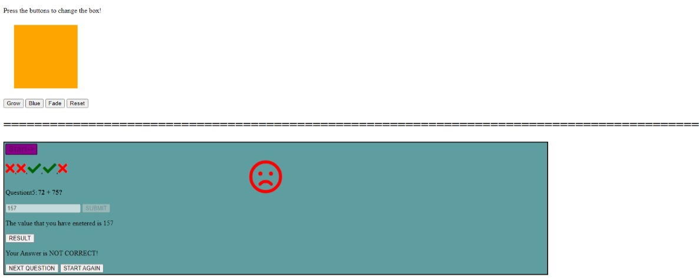

``` diff
# jiggle-into-javascript
```
This project contains a maths addition quiz,built using javascript.

User goes through a series of 10 addition questions

When user clicks on Result button after submitting his answer
Then he is presented with a happy/sad face animated on the screen.

All of his answers are shown in the form of tick(green) or cross(red) at the top of the questions.

When user clicks RESET
Then the question count starts from 1 again

``` diff
# Screenshot
```


``` diff
live app link: https://rajnidua.github.io/jiggle-into-javascript/
```


